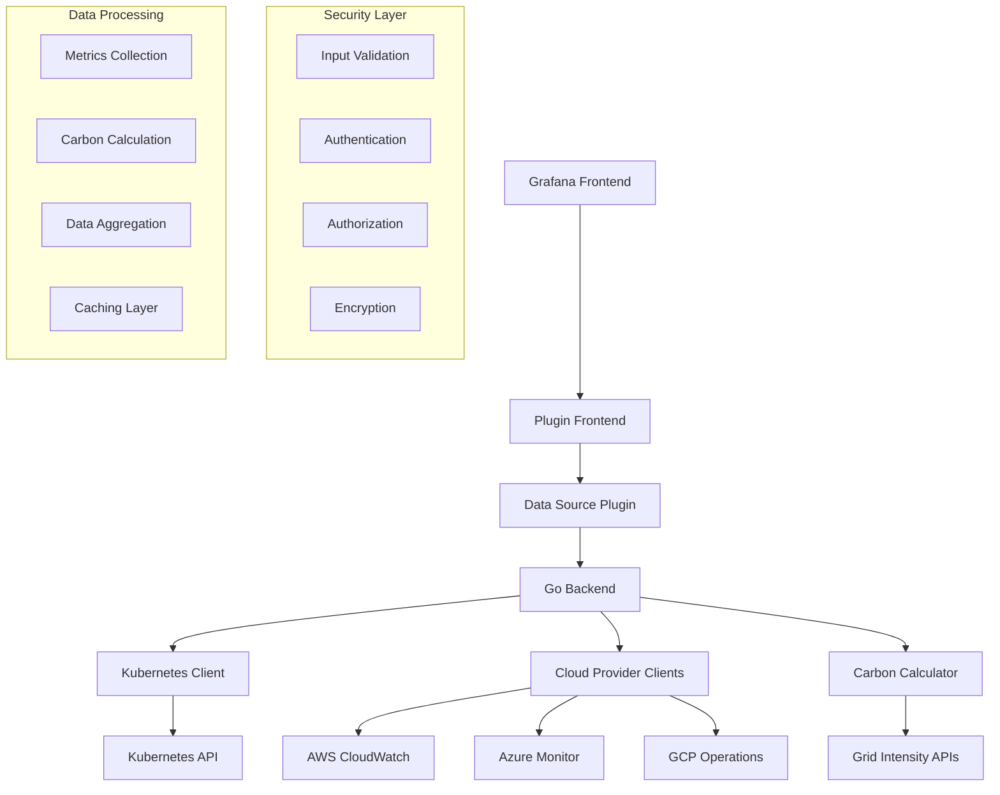
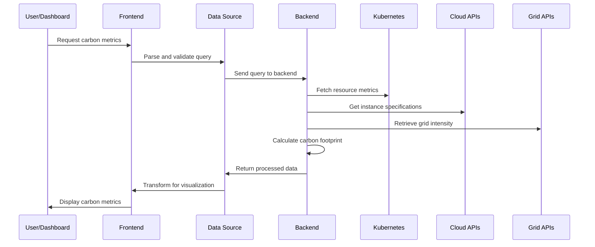
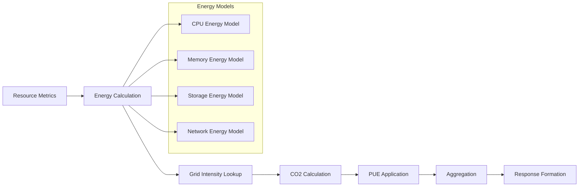
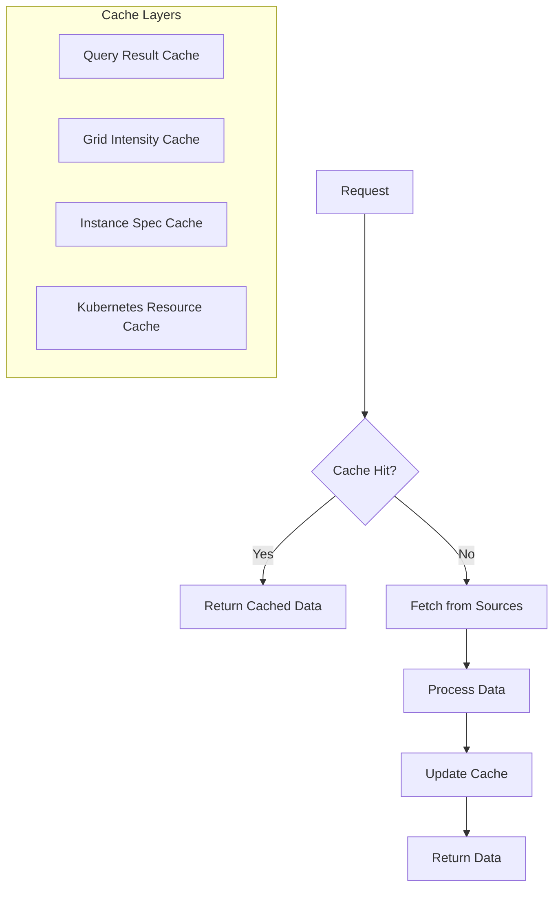
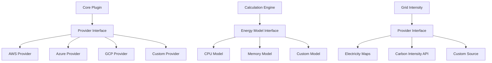

# Architecture Documentation

## Overview

The k8scarbonfootprint plugin is designed as a comprehensive Grafana application that monitors and visualizes carbon footprint data from Kubernetes workloads across cloud providers. The architecture follows a modular, secure, and scalable design pattern.

## System Architecture



## Component Architecture

### Frontend Components

#### 1. App Plugin (`src/module.ts`)
- **Purpose**: Main entry point for the Grafana application
- **Responsibilities**:
  - Plugin initialization and configuration
  - Navigation management between app pages
  - Global state management
- **Key Features**:
  - Modular page routing
  - Configuration persistence
  - Theme integration

#### 2. Data Source Plugin (`src/datasources/CarbonDataSource.ts`)
- **Purpose**: Bridge between Grafana and the carbon metrics backend
- **Responsibilities**:
  - Query parsing and validation
  - Backend communication
  - Data transformation for visualization
- **Security Features**:
  - Input sanitization
  - Secure credential handling
  - Connection validation

#### 3. Metrics Collector (`src/datasources/CarbonMetricsCollector.ts`)
- **Purpose**: Frontend coordination of metrics collection
- **Responsibilities**:
  - Query orchestration
  - Mock data handling for development
  - Error handling and retry logic

### Backend Components

#### 1. Main Service (`pkg/main.go`)
- **Purpose**: Core backend service handling datasource operations
- **Responsibilities**:
  - HTTP request handling
  - Plugin lifecycle management
  - Health checks and monitoring
- **Architecture Patterns**:
  - Dependency injection
  - Interface-based design
  - Graceful shutdown handling

#### 2. Carbon Calculator (`pkg/carbon/calculator.go`)
- **Purpose**: Core carbon footprint calculation engine
- **Responsibilities**:
  - Energy consumption calculations
  - CO2 emission calculations
  - Grid intensity integration
  - Resource utilization analysis
- **Calculation Models**:
  - CPU-based energy estimation
  - Memory usage accounting
  - Network and storage overhead
  - Cloud provider TDP (Thermal Design Power) integration

#### 3. Kubernetes Client
- **Purpose**: Interface with Kubernetes APIs
- **Responsibilities**:
  - Resource discovery and monitoring
  - Metrics collection
  - RBAC integration
- **Supported Resources**:
  - Nodes (compute instances)
  - Pods (workload containers)
  - Namespaces (logical groupings)
  - Persistent Volumes (storage)

#### 4. Cloud Provider Clients
- **Purpose**: Integration with cloud provider monitoring APIs
- **Responsibilities**:
  - Instance metadata collection
  - Usage metrics gathering
  - Cost correlation data
- **Supported Providers**:
  - AWS (CloudWatch, EC2)
  - Azure (Monitor, Compute)
  - GCP (Operations, Compute Engine)

## Data Flow Architecture

### 1. Query Processing Flow



### 2. Carbon Calculation Pipeline



## Security Architecture

### 1. Authentication and Authorization

- **Kubernetes RBAC**: Role-based access control for cluster resources
- **Cloud Provider IAM**: Least-privilege access to monitoring APIs
- **Grafana Integration**: Native Grafana authentication and permissions
- **API Key Management**: Secure storage and rotation of external API keys

### 2. Data Protection

- **Encryption at Rest**: Secure storage of configuration and credentials
- **Encryption in Transit**: TLS for all API communications
- **Input Validation**: Comprehensive sanitization of user inputs
- **Output Encoding**: Prevention of XSS and injection attacks

### 3. Security Monitoring

- **Audit Logging**: Comprehensive logging of security events
- **Vulnerability Scanning**: Automated dependency and container scanning
- **Secret Detection**: Prevention of credential exposure
- **Security Headers**: Implementation of secure HTTP headers

## Performance Architecture

### 1. Caching Strategy



### 2. Optimization Strategies

- **Batch Processing**: Efficient bulk operations for large clusters
- **Connection Pooling**: Reuse of expensive connections
- **Lazy Loading**: On-demand resource loading
- **Data Compression**: Reduced network overhead
- **Parallel Processing**: Concurrent API calls and calculations

### 3. Carbon Efficiency

- **Efficient Algorithms**: Optimized calculation methods
- **Minimal Resource Usage**: Low memory and CPU footprint
- **Smart Polling**: Adaptive refresh intervals
- **Regional Optimization**: Preference for low-carbon data centers

## Extensibility Architecture

### 1. Plugin System



### 2. Configuration Management

- **Environment Variables**: Runtime configuration
- **Config Files**: Structured configuration management
- **Database Storage**: Persistent settings
- **Hot Reloading**: Dynamic configuration updates

### 3. Custom Integrations

- **Webhook Support**: External data source integration
- **Plugin APIs**: Extension point definitions
- **Custom Panels**: Specialized visualization components
- **Custom Dashboards**: Domain-specific dashboard templates

## Deployment Architecture

### 1. Container Strategy

```dockerfile
# Multi-stage build for security and efficiency
FROM node:18-alpine AS frontend-builder
# Frontend build steps...

FROM golang:1.21-alpine AS backend-builder  
# Backend build steps...

FROM alpine:3.18
# Minimal runtime with security hardening
```

### 2. Kubernetes Deployment

```yaml
apiVersion: apps/v1
kind: Deployment
metadata:
  name: k8scarbonfootprint
spec:
  replicas: 2
  template:
    spec:
      securityContext:
        runAsNonRoot: true
        runAsUser: 1001
      containers:
      - name: plugin
        image: k8scarbonfootprint:latest
        securityContext:
          allowPrivilegeEscalation: false
          readOnlyRootFilesystem: true
        resources:
          requests:
            memory: "64Mi"
            cpu: "50m"
          limits:
            memory: "128Mi"
            cpu: "100m"
```

### 3. Monitoring and Observability

- **Health Checks**: Comprehensive service health monitoring
- **Metrics Export**: Prometheus-compatible metrics
- **Distributed Tracing**: Request tracing across components
- **Log Aggregation**: Centralized logging with structured formats

## Technology Stack

### Frontend
- **TypeScript**: Type-safe JavaScript development
- **React**: Component-based UI framework
- **Grafana UI Library**: Consistent styling and components
- **Jest**: Unit testing framework
- **ESLint/Prettier**: Code quality and formatting

### Backend
- **Go**: High-performance, concurrent backend
- **Grafana Plugin SDK**: Native Grafana integration
- **Kubernetes Client**: Official K8s Go client
- **Cloud SDKs**: Provider-specific API clients
- **Testify**: Go testing framework

### DevSecOps
- **GitHub Actions**: CI/CD pipeline automation
- **Trivy**: Container and dependency scanning
- **Semgrep**: Static code analysis
- **GoReleaser**: Automated release management
- **Docker**: Containerization and deployment

## Design Principles

### 1. Security First
- All components designed with security as a primary concern
- Zero-trust networking model
- Principle of least privilege
- Defense in depth strategy

### 2. Carbon Efficiency
- Minimal resource consumption
- Efficient algorithms and data structures
- Smart caching and batching
- Green computing best practices

### 3. Scalability
- Horizontal scaling capabilities
- Stateless design where possible
- Efficient resource utilization
- Load balancing support

### 4. Maintainability
- Clean code principles
- Comprehensive documentation
- Automated testing
- Modular architecture

### 5. User Experience
- Intuitive interfaces
- Fast response times
- Comprehensive error handling
- Accessibility compliance

This architecture provides a solid foundation for monitoring Kubernetes carbon footprint while maintaining security, performance, and extensibility requirements.