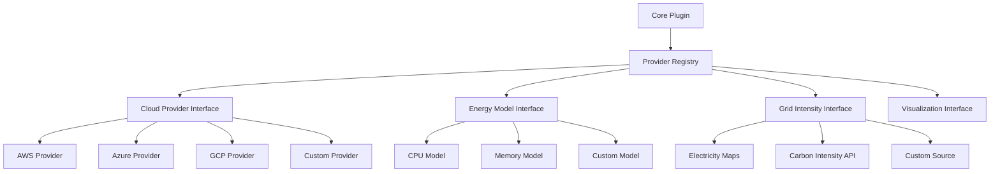

# Extensibility Guide

## Overview

The k8scarbonfootprint plugin is designed with extensibility as a core principle. This guide provides comprehensive information on how to extend the plugin to support new cloud providers, custom energy models, additional data sources, and specialized visualizations.

## Architecture for Extensibility

### Plugin Interface System



## Adding New Cloud Providers

### 1. Cloud Provider Interface

```go
// pkg/cloud/provider.go
type CloudProvider interface {
    // GetInstanceSpecs retrieves specifications for cloud instances
    GetInstanceSpecs(ctx context.Context, instanceType string) (*InstanceSpecs, error)
    
    // GetMetrics retrieves usage metrics from cloud provider
    GetMetrics(ctx context.Context, request *MetricsRequest) (*MetricsResponse, error)
    
    // GetRegions returns available regions for the provider
    GetRegions(ctx context.Context) ([]Region, error)
    
    // GetInstanceTypes returns available instance types
    GetInstanceTypes(ctx context.Context, region string) ([]InstanceType, error)
    
    // TestConnection validates provider credentials and connectivity
    TestConnection(ctx context.Context) error
    
    // Close cleans up provider resources
    Close() error
}

type InstanceSpecs struct {
    InstanceType     string  `json:"instanceType"`
    VCPUs           int     `json:"vcpus"`
    MemoryGB        float64 `json:"memoryGb"`
    StorageGB       float64 `json:"storageGb,omitempty"`
    NetworkPerformance string `json:"networkPerformance"`
    TDP             float64 `json:"tdp"` // Thermal Design Power in watts
    Architecture    string  `json:"architecture"`
    Processor       string  `json:"processor,omitempty"`
}

type MetricsRequest struct {
    InstanceIDs []string    `json:"instanceIds"`
    StartTime   time.Time   `json:"startTime"`
    EndTime     time.Time   `json:"endTime"`
    MetricNames []string    `json:"metricNames"`
    Region      string      `json:"region"`
}

type MetricsResponse struct {
    Metrics []CloudMetric `json:"metrics"`
}

type CloudMetric struct {
    InstanceID string            `json:"instanceId"`
    MetricName string            `json:"metricName"`
    Values     []MetricDataPoint `json:"values"`
    Unit       string            `json:"unit"`
}
```

### 2. Example: Oracle Cloud Provider Implementation

```go
// pkg/cloud/oracle.go
package cloud

import (
    "context"
    "fmt"
    
    "github.com/oracle/oci-go-sdk/v65/common"
    "github.com/oracle/oci-go-sdk/v65/core"
    "github.com/oracle/oci-go-sdk/v65/monitoring"
)

type OracleCloudProvider struct {
    computeClient    core.ComputeClient
    monitoringClient monitoring.MonitoringClient
    config          *OracleConfig
}

type OracleConfig struct {
    TenancyOCID     string `json:"tenancyOcid"`
    UserOCID        string `json:"userOcid"`
    Region          string `json:"region"`
    Fingerprint     string `json:"fingerprint"`
    PrivateKey      string `json:"privateKey"`
    CompartmentOCID string `json:"compartmentOcid"`
}

func NewOracleCloudProvider(config *OracleConfig) (*OracleCloudProvider, error) {
    configProvider := common.NewRawConfigurationProvider(
        config.TenancyOCID,
        config.UserOCID,
        config.Region,
        config.Fingerprint,
        config.PrivateKey,
        nil,
    )
    
    computeClient, err := core.NewComputeClientWithConfigurationProvider(configProvider)
    if err != nil {
        return nil, fmt.Errorf("failed to create compute client: %w", err)
    }
    
    monitoringClient, err := monitoring.NewMonitoringClientWithConfigurationProvider(configProvider)
    if err != nil {
        return nil, fmt.Errorf("failed to create monitoring client: %w", err)
    }
    
    return &OracleCloudProvider{
        computeClient:    computeClient,
        monitoringClient: monitoringClient,
        config:          config,
    }, nil
}

func (o *OracleCloudProvider) GetInstanceSpecs(ctx context.Context, instanceType string) (*InstanceSpecs, error) {
    // Get shape details from Oracle Cloud
    request := core.GetShapeRequest{
        ShapeName: common.String(instanceType),
    }
    
    response, err := o.computeClient.GetShape(ctx, request)
    if err != nil {
        return nil, fmt.Errorf("failed to get shape specs: %w", err)
    }
    
    shape := response.Shape
    
    return &InstanceSpecs{
        InstanceType:       instanceType,
        VCPUs:             int(*shape.Ocpus),
        MemoryGB:          float64(*shape.MemoryInGBs),
        NetworkPerformance: *shape.NetworkPorts,
        TDP:               estimateOracleTDP(*shape.Ocpus, *shape.MemoryInGBs),
        Architecture:      "x86_64", // Most Oracle shapes
        Processor:         *shape.ProcessorDescription,
    }, nil
}

func (o *OracleCloudProvider) GetMetrics(ctx context.Context, request *MetricsRequest) (*MetricsResponse, error) {
    var metrics []CloudMetric
    
    for _, instanceID := range request.InstanceIDs {
        for _, metricName := range request.MetricNames {
            // Query Oracle Cloud monitoring
            query := fmt.Sprintf(`%s[1m]{resourceId = "%s"}`, metricName, instanceID)
            
            monitoringRequest := monitoring.SummarizeMetricsDataRequest{
                CompartmentId: common.String(o.config.CompartmentOCID),
                SummarizeMetricsDataDetails: monitoring.SummarizeMetricsDataDetails{
                    Query:     common.String(query),
                    StartTime: &common.SDKTime{Time: request.StartTime},
                    EndTime:   &common.SDKTime{Time: request.EndTime},
                },
            }
            
            response, err := o.monitoringClient.SummarizeMetricsData(ctx, monitoringRequest)
            if err != nil {
                continue // Skip failed metrics
            }
            
            var values []MetricDataPoint
            for _, dataPoint := range response.Items {
                if dataPoint.AggregatedDatapoints != nil {
                    for _, point := range dataPoint.AggregatedDatapoints {
                        values = append(values, MetricDataPoint{
                            Timestamp: point.Timestamp.Time,
                            Value:     *point.Value,
                        })
                    }
                }
            }
            
            metrics = append(metrics, CloudMetric{
                InstanceID: instanceID,
                MetricName: metricName,
                Values:     values,
                Unit:       "Percent", // Oracle Cloud default
            })
        }
    }
    
    return &MetricsResponse{Metrics: metrics}, nil
}

func (o *OracleCloudProvider) GetRegions(ctx context.Context) ([]Region, error) {
    // Oracle Cloud regions
    regions := []Region{
        {Code: "us-phoenix-1", Name: "US West (Phoenix)", CarbonIntensity: 420},
        {Code: "us-ashburn-1", Name: "US East (Ashburn)", CarbonIntensity: 450},
        {Code: "eu-frankfurt-1", Name: "Germany Central (Frankfurt)", CarbonIntensity: 320},
        {Code: "ap-tokyo-1", Name: "Japan East (Tokyo)", CarbonIntensity: 480},
        // Add more regions as needed
    }
    
    return regions, nil
}

func (o *OracleCloudProvider) TestConnection(ctx context.Context) error {
    // Test connection by listing available shapes
    request := core.ListShapesRequest{
        CompartmentId: common.String(o.config.CompartmentOCID),
        Limit:         common.Int(1),
    }
    
    _, err := o.computeClient.ListShapes(ctx, request)
    return err
}

func (o *OracleCloudProvider) Close() error {
    // No explicit cleanup needed for Oracle SDK
    return nil
}

func estimateOracleTDP(ocpus float32, memoryGB float32) float64 {
    // Estimated TDP for Oracle Cloud shapes
    // Base consumption + CPU factor + memory factor
    baseTDP := 20.0
    cpuTDP := float64(ocpus) * 15.0  // 15W per OCPU
    memoryTDP := float64(memoryGB) * 0.5 // 0.5W per GB
    
    return baseTDP + cpuTDP + memoryTDP
}
```

### 3. Provider Registration

```go
// pkg/cloud/registry.go
type ProviderRegistry struct {
    providers map[string]ProviderFactory
    mutex     sync.RWMutex
}

type ProviderFactory func(config interface{}) (CloudProvider, error)

func NewProviderRegistry() *ProviderRegistry {
    registry := &ProviderRegistry{
        providers: make(map[string]ProviderFactory),
    }
    
    // Register built-in providers
    registry.RegisterProvider("aws", func(config interface{}) (CloudProvider, error) {
        cfg := config.(*AWSConfig)
        return NewAWSCloudProvider(cfg)
    })
    
    registry.RegisterProvider("azure", func(config interface{}) (CloudProvider, error) {
        cfg := config.(*AzureConfig)
        return NewAzureCloudProvider(cfg)
    })
    
    registry.RegisterProvider("gcp", func(config interface{}) (CloudProvider, error) {
        cfg := config.(*GCPConfig)
        return NewGCPCloudProvider(cfg)
    })
    
    return registry
}

func (r *ProviderRegistry) RegisterProvider(name string, factory ProviderFactory) {
    r.mutex.Lock()
    defer r.mutex.Unlock()
    r.providers[name] = factory
}

func (r *ProviderRegistry) CreateProvider(name string, config interface{}) (CloudProvider, error) {
    r.mutex.RLock()
    factory, exists := r.providers[name]
    r.mutex.RUnlock()
    
    if !exists {
        return nil, fmt.Errorf("unknown provider: %s", name)
    }
    
    return factory(config)
}
```

## Custom Energy Models

### 1. Energy Model Interface

```go
// pkg/carbon/energy_model.go
type EnergyModel interface {
    // CalculateEnergyConsumption calculates energy usage for a resource
    CalculateEnergyConsumption(ctx context.Context, resource *Resource) (float64, error)
    
    // GetModelName returns the name of the energy model
    GetModelName() string
    
    // GetModelVersion returns the version of the energy model
    GetModelVersion() string
    
    // ValidateResource checks if the resource is supported by this model
    ValidateResource(resource *Resource) error
}

type Resource struct {
    Type         string                 `json:"type"` // "pod", "node", "container"
    Name         string                 `json:"name"`
    Namespace    string                 `json:"namespace,omitempty"`
    Labels       map[string]string      `json:"labels,omitempty"`
    Annotations  map[string]string      `json:"annotations,omitempty"`
    Metrics      map[string]interface{} `json:"metrics"`
    Specifications map[string]interface{} `json:"specifications"`
}
```

### 2. Example: Machine Learning-Based Energy Model

```go
// pkg/carbon/ml_energy_model.go
type MLEnergyModel struct {
    modelPath    string
    predictor    *tensorflow.Predictor
    scaler      *StandardScaler
    initialized bool
    mutex       sync.RWMutex
}

func NewMLEnergyModel(modelPath string) *MLEnergyModel {
    return &MLEnergyModel{
        modelPath: modelPath,
    }
}

func (m *MLEnergyModel) Initialize() error {
    m.mutex.Lock()
    defer m.mutex.Unlock()
    
    if m.initialized {
        return nil
    }
    
    // Load TensorFlow model
    predictor, err := tensorflow.LoadModel(m.modelPath)
    if err != nil {
        return fmt.Errorf("failed to load ML model: %w", err)
    }
    
    // Load scaler for feature normalization
    scaler, err := LoadStandardScaler(m.modelPath + "/scaler.json")
    if err != nil {
        return fmt.Errorf("failed to load scaler: %w", err)
    }
    
    m.predictor = predictor
    m.scaler = scaler
    m.initialized = true
    
    return nil
}

func (m *MLEnergyModel) CalculateEnergyConsumption(ctx context.Context, resource *Resource) (float64, error) {
    if err := m.Initialize(); err != nil {
        return 0, err
    }
    
    // Extract features for ML model
    features, err := m.extractFeatures(resource)
    if err != nil {
        return 0, fmt.Errorf("failed to extract features: %w", err)
    }
    
    // Normalize features
    normalizedFeatures := m.scaler.Transform(features)
    
    // Predict energy consumption
    prediction, err := m.predictor.Predict(normalizedFeatures)
    if err != nil {
        return 0, fmt.Errorf("prediction failed: %w", err)
    }
    
    return prediction[0], nil
}

func (m *MLEnergyModel) extractFeatures(resource *Resource) ([]float64, error) {
    features := make([]float64, 0, 10)
    
    // CPU-related features
    if cpuRequest, ok := resource.Metrics["cpu_request"].(float64); ok {
        features = append(features, cpuRequest)
    } else {
        features = append(features, 0)
    }
    
    if cpuUsage, ok := resource.Metrics["cpu_usage"].(float64); ok {
        features = append(features, cpuUsage)
    } else {
        features = append(features, 0)
    }
    
    // Memory-related features
    if memRequest, ok := resource.Metrics["memory_request"].(float64); ok {
        features = append(features, memRequest)
    } else {
        features = append(features, 0)
    }
    
    if memUsage, ok := resource.Metrics["memory_usage"].(float64); ok {
        features = append(features, memUsage)
    } else {
        features = append(features, 0)
    }
    
    // Network and storage features
    if networkIO, ok := resource.Metrics["network_io"].(float64); ok {
        features = append(features, networkIO)
    } else {
        features = append(features, 0)
    }
    
    if diskIO, ok := resource.Metrics["disk_io"].(float64); ok {
        features = append(features, diskIO)
    } else {
        features = append(features, 0)
    }
    
    // Instance type encoding (categorical)
    instanceType := ""
    if it, ok := resource.Specifications["instance_type"].(string); ok {
        instanceType = it
    }
    
    // One-hot encode instance types
    instanceFeatures := m.encodeInstanceType(instanceType)
    features = append(features, instanceFeatures...)
    
    return features, nil
}

func (m *MLEnergyModel) encodeInstanceType(instanceType string) []float64 {
    // Simple one-hot encoding for common instance types
    encoding := make([]float64, 4) // Support 4 instance type categories
    
    switch instanceType {
    case "m5.large", "m5.xlarge":
        encoding[0] = 1.0 // General purpose
    case "c5.large", "c5.xlarge":
        encoding[1] = 1.0 // Compute optimized
    case "r5.large", "r5.xlarge":
        encoding[2] = 1.0 // Memory optimized
    default:
        encoding[3] = 1.0 // Other/unknown
    }
    
    return encoding
}

func (m *MLEnergyModel) GetModelName() string {
    return "ML-Based Energy Model"
}

func (m *MLEnergyModel) GetModelVersion() string {
    return "1.0.0"
}

func (m *MLEnergyModel) ValidateResource(resource *Resource) error {
    requiredMetrics := []string{"cpu_request", "memory_request"}
    
    for _, metric := range requiredMetrics {
        if _, ok := resource.Metrics[metric]; !ok {
            return fmt.Errorf("missing required metric: %s", metric)
        }
    }
    
    return nil
}
```

## Custom Grid Intensity Sources

### 1. Grid Intensity Interface

```go
// pkg/carbon/grid_intensity.go
type GridIntensityProvider interface {
    // GetGridIntensity retrieves current grid carbon intensity
    GetGridIntensity(ctx context.Context, region string) (float64, error)
    
    // GetHistoricalIntensity retrieves historical grid intensity data
    GetHistoricalIntensity(ctx context.Context, region string, start, end time.Time) ([]IntensityDataPoint, error)
    
    // GetForecastIntensity retrieves forecasted grid intensity
    GetForecastIntensity(ctx context.Context, region string, hours int) ([]IntensityDataPoint, error)
    
    // GetSupportedRegions returns regions supported by this provider
    GetSupportedRegions() []string
    
    // GetProviderName returns the name of the provider
    GetProviderName() string
}

type IntensityDataPoint struct {
    Timestamp time.Time `json:"timestamp"`
    Intensity float64   `json:"intensity"` // gCO2/kWh
    Source    string    `json:"source"`
}
```

### 2. Example: Custom Grid Intensity Provider

```go
// pkg/carbon/custom_grid_provider.go
type CustomGridProvider struct {
    apiEndpoint string
    apiKey      string
    client      *http.Client
    cache       *IntensityCache
}

func NewCustomGridProvider(endpoint, apiKey string) *CustomGridProvider {
    return &CustomGridProvider{
        apiEndpoint: endpoint,
        apiKey:      apiKey,
        client: &http.Client{
            Timeout: 30 * time.Second,
            Transport: &http.Transport{
                TLSClientConfig: &tls.Config{
                    MinVersion: tls.VersionTLS12,
                },
            },
        },
        cache: NewIntensityCache(15 * time.Minute), // 15-minute cache
    }
}

func (c *CustomGridProvider) GetGridIntensity(ctx context.Context, region string) (float64, error) {
    // Check cache first
    if cached, found := c.cache.Get(region); found {
        return cached.Intensity, nil
    }
    
    // Make API request
    url := fmt.Sprintf("%s/intensity/current?region=%s", c.apiEndpoint, region)
    req, err := http.NewRequestWithContext(ctx, "GET", url, nil)
    if err != nil {
        return 0, err
    }
    
    req.Header.Set("Authorization", "Bearer "+c.apiKey)
    req.Header.Set("User-Agent", "k8scarbonfootprint/1.0")
    
    resp, err := c.client.Do(req)
    if err != nil {
        return 0, fmt.Errorf("API request failed: %w", err)
    }
    defer resp.Body.Close()
    
    if resp.StatusCode != http.StatusOK {
        return 0, fmt.Errorf("API returned status %d", resp.StatusCode)
    }
    
    var response struct {
        Intensity float64   `json:"intensity"`
        Timestamp time.Time `json:"timestamp"`
        Region    string    `json:"region"`
    }
    
    if err := json.NewDecoder(resp.Body).Decode(&response); err != nil {
        return 0, fmt.Errorf("failed to decode response: %w", err)
    }
    
    // Cache the result
    c.cache.Set(region, IntensityDataPoint{
        Timestamp: response.Timestamp,
        Intensity: response.Intensity,
        Source:    c.GetProviderName(),
    })
    
    return response.Intensity, nil
}

func (c *CustomGridProvider) GetProviderName() string {
    return "Custom Grid Intensity API"
}
```

## Custom Visualizations

### 1. Panel Plugin Interface

```typescript
// src/panels/CustomCarbonPanel.tsx
import React from 'react';
import { PanelPlugin, PanelProps } from '@grafana/data';
import { CustomCarbonOptions } from './types';

interface Props extends PanelProps<CustomCarbonOptions> {}

export const CustomCarbonPanel: React.FC<Props> = ({ data, options, width, height }) => {
  // Custom visualization logic here
  return (
    <div style={{ width, height }}>
      {/* Custom visualization implementation */}
    </div>
  );
};

export const plugin = new PanelPlugin<CustomCarbonOptions>(CustomCarbonPanel).setPanelOptions(builder => {
  return builder
    .addSelect({
      path: 'visualization',
      name: 'Visualization Type',
      description: 'Select the type of carbon visualization',
      defaultValue: 'treemap',
      settings: {
        options: [
          { value: 'treemap', label: 'Treemap' },
          { value: 'sankey', label: 'Sankey Diagram' },
          { value: 'bubble', label: 'Bubble Chart' },
        ],
      },
    })
    .addColorPicker({
      path: 'colorScheme',
      name: 'Color Scheme',
      description: 'Color scheme for carbon intensity',
      defaultValue: 'green',
    })
    .addBooleanSwitch({
      path: 'showOptimizations',
      name: 'Show Optimizations',
      description: 'Display optimization recommendations',
      defaultValue: true,
    });
});
```

### 2. Advanced Visualization: Carbon Flow Diagram

```typescript
// src/panels/CarbonFlowPanel.tsx
import React, { useMemo } from 'react';
import { DataFrame, Field, FieldType } from '@grafana/data';
import * as d3 from 'd3';
import { Sankey, sankeyLinkHorizontal } from 'd3-sankey';

interface CarbonFlowData {
  nodes: Array<{ id: string; name: string; category: string }>;
  links: Array<{ source: number; target: number; value: number }>;
}

export const CarbonFlowPanel: React.FC<Props> = ({ data, width, height }) => {
  const flowData = useMemo(() => {
    return processDataForSankey(data.series);
  }, [data.series]);

  const sankeyData = useMemo(() => {
    const sankey = d3.sankey<CarbonFlowData['nodes'][0], CarbonFlowData['links'][0]>()
      .nodeWidth(15)
      .nodePadding(10)
      .size([width - 100, height - 100]);

    return sankey(flowData);
  }, [flowData, width, height]);

  return (
    <svg width={width} height={height}>
      <g transform="translate(50,50)">
        {/* Render links */}
        {sankeyData.links.map((link, i) => (
          <path
            key={i}
            d={sankeyLinkHorizontal()(link)}
            fill="none"
            stroke={getCarbonIntensityColor(link.value)}
            strokeWidth={Math.max(1, link.width)}
            strokeOpacity={0.7}
          />
        ))}
        
        {/* Render nodes */}
        {sankeyData.nodes.map((node, i) => (
          <g key={i}>
            <rect
              x={node.x0}
              y={node.y0}
              width={node.x1 - node.x0}
              height={node.y1 - node.y0}
              fill={getNodeColor(node.category)}
              stroke="#000"
              strokeWidth={0.5}
            />
            <text
              x={node.x0 - 6}
              y={(node.y0 + node.y1) / 2}
              textAnchor="end"
              alignmentBaseline="middle"
              fontSize="12"
            >
              {node.name}
            </text>
          </g>
        ))}
      </g>
    </svg>
  );
};

function processDataForSankey(series: DataFrame[]): CarbonFlowData {
  // Transform Grafana data frames into Sankey diagram format
  const nodes: CarbonFlowData['nodes'] = [];
  const links: CarbonFlowData['links'] = [];
  const nodeMap = new Map<string, number>();

  // Process data frames to extract carbon flow relationships
  series.forEach(frame => {
    // Extract hierarchical carbon flow data
    // Implementation depends on your specific data structure
  });

  return { nodes, links };
}
```

## Configuration Extension

### 1. Dynamic Configuration Schema

```typescript
// src/types/ConfigSchema.ts
export interface ExtensibleConfig {
  core: CoreConfig;
  providers: Record<string, ProviderConfig>;
  energyModels: Record<string, EnergyModelConfig>;
  customizations: CustomizationConfig;
}

export interface ProviderConfig {
  type: string;
  enabled: boolean;
  settings: Record<string, any>;
  credentials: Record<string, string>;
}

export interface EnergyModelConfig {
  type: string;
  enabled: boolean;
  priority: number;
  settings: Record<string, any>;
}

export interface CustomizationConfig {
  dashboards: CustomDashboard[];
  panels: CustomPanel[];
  alerts: CustomAlert[];
}
```

### 2. Plugin Extension Registry

```typescript
// src/extensions/PluginRegistry.ts
export class PluginExtensionRegistry {
  private providers = new Map<string, ProviderFactory>();
  private energyModels = new Map<string, EnergyModelFactory>();
  private panels = new Map<string, PanelFactory>();

  registerProvider(name: string, factory: ProviderFactory): void {
    this.providers.set(name, factory);
  }

  registerEnergyModel(name: string, factory: EnergyModelFactory): void {
    this.energyModels.set(name, factory);
  }

  registerPanel(name: string, factory: PanelFactory): void {
    this.panels.set(name, factory);
  }

  createProvider(name: string, config: any): CloudProvider {
    const factory = this.providers.get(name);
    if (!factory) {
      throw new Error(`Unknown provider: ${name}`);
    }
    return factory(config);
  }

  getAvailableProviders(): string[] {
    return Array.from(this.providers.keys());
  }

  getAvailableEnergyModels(): string[] {
    return Array.from(this.energyModels.keys());
  }
}

// Global registry instance
export const extensionRegistry = new PluginExtensionRegistry();
```

## Webhook Integration

### 1. Webhook Interface

```go
// pkg/webhook/handler.go
type WebhookHandler interface {
    // HandleWebhook processes incoming webhook data
    HandleWebhook(ctx context.Context, payload []byte) (*WebhookResponse, error)
    
    // GetWebhookType returns the type of webhook this handler supports
    GetWebhookType() string
    
    // ValidatePayload validates the webhook payload
    ValidatePayload(payload []byte) error
}

type WebhookResponse struct {
    Success bool                   `json:"success"`
    Message string                 `json:"message"`
    Data    map[string]interface{} `json:"data,omitempty"`
}
```

### 2. Custom Metrics Webhook

```go
// pkg/webhook/custom_metrics.go
type CustomMetricsWebhook struct {
    validator *PayloadValidator
    processor *MetricsProcessor
}

func (c *CustomMetricsWebhook) HandleWebhook(ctx context.Context, payload []byte) (*WebhookResponse, error) {
    if err := c.ValidatePayload(payload); err != nil {
        return &WebhookResponse{
            Success: false,
            Message: fmt.Sprintf("Invalid payload: %v", err),
        }, nil
    }
    
    var metrics CustomMetrics
    if err := json.Unmarshal(payload, &metrics); err != nil {
        return &WebhookResponse{
            Success: false,
            Message: "Failed to parse metrics",
        }, nil
    }
    
    // Process custom metrics
    carbonMetrics, err := c.processor.ProcessCustomMetrics(ctx, &metrics)
    if err != nil {
        return &WebhookResponse{
            Success: false,
            Message: fmt.Sprintf("Processing failed: %v", err),
        }, nil
    }
    
    return &WebhookResponse{
        Success: true,
        Message: "Metrics processed successfully",
        Data: map[string]interface{}{
            "processed_count": len(carbonMetrics),
            "total_co2":      calculateTotalCO2(carbonMetrics),
        },
    }, nil
}

type CustomMetrics struct {
    Timestamp   time.Time              `json:"timestamp"`
    Source      string                 `json:"source"`
    Region      string                 `json:"region"`
    Resources   []CustomResource       `json:"resources"`
    Metadata    map[string]interface{} `json:"metadata"`
}

type CustomResource struct {
    ID          string                 `json:"id"`
    Type        string                 `json:"type"`
    Name        string                 `json:"name"`
    Namespace   string                 `json:"namespace,omitempty"`
    Metrics     map[string]float64     `json:"metrics"`
    Labels      map[string]string      `json:"labels,omitempty"`
}
```

## Testing Extensions

### 1. Extension Testing Framework

```go
// pkg/testing/extension_test.go
func TestProviderExtension(t *testing.T) {
    // Test custom provider registration and usage
    registry := NewProviderRegistry()
    
    // Register test provider
    registry.RegisterProvider("test", func(config interface{}) (CloudProvider, error) {
        return &TestCloudProvider{}, nil
    })
    
    // Test provider creation
    provider, err := registry.CreateProvider("test", nil)
    assert.NoError(t, err)
    assert.NotNil(t, provider)
    
    // Test provider interface compliance
    assert.Implements(t, (*CloudProvider)(nil), provider)
}

func TestEnergyModelExtension(t *testing.T) {
    // Test custom energy model
    model := &TestEnergyModel{}
    
    resource := &Resource{
        Type: "pod",
        Name: "test-pod",
        Metrics: map[string]interface{}{
            "cpu_request": 100.0,
            "memory_request": 512.0,
        },
    }
    
    energy, err := model.CalculateEnergyConsumption(context.Background(), resource)
    assert.NoError(t, err)
    assert.Greater(t, energy, 0.0)
}
```

### 2. Integration Testing

```typescript
// src/extensions/__tests__/integration.test.ts
describe('Extension Integration', () => {
  it('should load custom providers dynamically', async () => {
    const registry = new PluginExtensionRegistry();
    
    // Register custom provider
    registry.registerProvider('custom', (config) => new CustomProvider(config));
    
    // Test provider creation
    const provider = registry.createProvider('custom', { endpoint: 'test' });
    expect(provider).toBeInstanceOf(CustomProvider);
  });

  it('should handle custom panel registration', () => {
    const registry = new PluginExtensionRegistry();
    
    registry.registerPanel('custom-carbon-flow', CustomCarbonFlowPanel);
    
    const availablePanels = registry.getAvailablePanels();
    expect(availablePanels).toContain('custom-carbon-flow');
  });
});
```

## Documentation for Extensions

### 1. Extension Development Guide

Create comprehensive documentation for extension developers:

```markdown
# Extension Development Guide

## Quick Start

1. **Clone the plugin repository**
2. **Create your extension directory** under `src/extensions/`
3. **Implement the required interfaces**
4. **Register your extension** with the plugin registry
5. **Add tests** for your extension
6. **Submit a pull request**

## Best Practices

- Follow the existing code style and patterns
- Implement comprehensive error handling
- Add unit tests with >80% coverage
- Document your extension's configuration options
- Use TypeScript for type safety
- Follow security best practices

## Example Extensions

See the `examples/` directory for complete extension examples:
- Custom cloud provider
- Machine learning energy model
- Custom visualization panel
- Webhook integration
```

This extensibility guide provides a comprehensive framework for extending the k8scarbonfootprint plugin to meet diverse organizational needs while maintaining code quality and security standards.