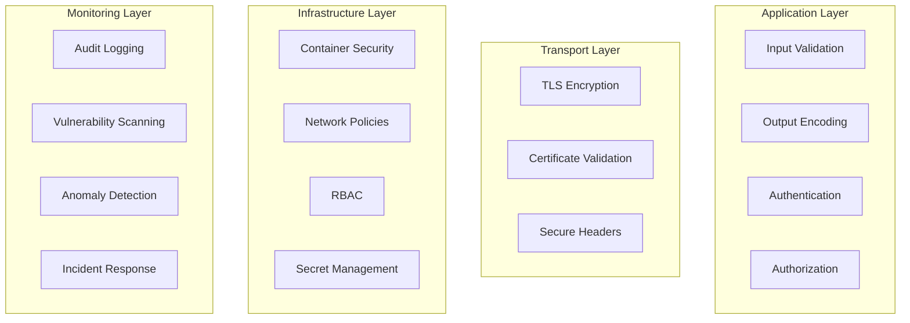

# Security Documentation

## Security Overview

The k8scarbonfootprint plugin implements comprehensive security measures following DevSecOps principles and industry best practices. Security is integrated at every layer of the architecture, from development to deployment.

## Security Architecture

### Defense in Depth Strategy



## Authentication and Authorization

### 1. Kubernetes RBAC Integration

```yaml
apiVersion: rbac.authorization.k8s.io/v1
kind: ClusterRole
metadata:
  name: k8scarbonfootprint-reader
rules:
- apiGroups: [""]
  resources: ["nodes", "pods", "namespaces", "persistentvolumes"]
  verbs: ["get", "list", "watch"]
- apiGroups: ["metrics.k8s.io"]
  resources: ["nodes", "pods"]
  verbs: ["get", "list"]
- apiGroups: ["apps"]
  resources: ["deployments", "replicasets", "daemonsets", "statefulsets"]
  verbs: ["get", "list"]
```

**Security Principles:**
- **Least Privilege**: Only necessary permissions granted
- **Resource Scoping**: Limited to required Kubernetes resources
- **Read-Only Access**: No write permissions to cluster resources
- **Namespace Isolation**: Optional namespace-specific permissions

### 2. Cloud Provider Authentication

#### AWS IAM Policy
```json
{
    "Version": "2012-10-17",
    "Statement": [
        {
            "Effect": "Allow",
            "Action": [
                "cloudwatch:GetMetricStatistics",
                "cloudwatch:ListMetrics",
                "ec2:DescribeInstances",
                "ec2:DescribeInstanceTypes"
            ],
            "Resource": "*",
            "Condition": {
                "StringEquals": {
                    "aws:RequestedRegion": ["us-west-2", "us-east-1"]
                }
            }
        }
    ]
}
```

#### Azure Role Definition
```json
{
    "properties": {
        "roleName": "K8sCarbonFootprintReader",
        "description": "Read-only access for carbon footprint monitoring",
        "permissions": [
            {
                "actions": [
                    "Microsoft.Insights/metrics/read",
                    "Microsoft.Compute/virtualMachines/read",
                    "Microsoft.Compute/virtualMachineScaleSets/read"
                ],
                "notActions": [],
                "dataActions": [],
                "notDataActions": []
            }
        ]
    }
}
```

#### GCP IAM Roles
```yaml
bindings:
- members:
  - serviceAccount:k8scarbonfootprint@project.iam.gserviceaccount.com
  role: roles/monitoring.viewer
- members:
  - serviceAccount:k8scarbonfootprint@project.iam.gserviceaccount.com
  role: roles/compute.viewer
```

### 3. API Key Management

**Secure Storage Pattern:**
```typescript
// Frontend - using Grafana's secure JSON storage
const secureData = {
  kubernetesToken: this.secureJsonData?.kubernetesToken,
  awsAccessKey: this.secureJsonData?.awsAccessKey,
  awsSecretKey: this.secureJsonData?.awsSecretKey,
  // Never store in plaintext jsonData
};
```

**Backend - Secure Handling:**
```go
// Secure credential handling in Go backend
type SecureConfig struct {
    KubernetesToken string `json:"kubernetesToken,omitempty"`
    AWSAccessKey    string `json:"awsAccessKey,omitempty"`
    AWSSecretKey    string `json:"awsSecretKey,omitempty"`
}

func (c *SecureConfig) Validate() error {
    if c.KubernetesToken == "" {
        return errors.New("kubernetes token is required")
    }
    // Additional validation logic
    return nil
}
```

## Input Validation and Sanitization

### 1. Query Parameter Validation

```typescript
const validateCarbonQuery = (query: CarbonQuery): ValidationResult => {
  const errors: string[] = [];
  
  // Validate required fields
  if (!query.refId || !/^[A-Z]$/.test(query.refId)) {
    errors.push('Invalid refId format');
  }
  
  // Validate resource type
  const validResourceTypes = ['cluster', 'namespace', 'node', 'pod'];
  if (!validResourceTypes.includes(query.resourceType)) {
    errors.push('Invalid resource type');
  }
  
  // Validate time range
  if (query.timeRange) {
    const from = new Date(query.timeRange.from);
    const to = new Date(query.timeRange.to);
    
    if (isNaN(from.getTime()) || isNaN(to.getTime())) {
      errors.push('Invalid time range format');
    }
    
    if (from >= to) {
      errors.push('Invalid time range: from must be before to');
    }
  }
  
  // Validate filters
  if (query.filters) {
    for (const [key, value] of Object.entries(query.filters)) {
      if (typeof key !== 'string' || key.length > 100) {
        errors.push('Invalid filter key');
      }
      
      if (typeof value === 'string' && value.length > 1000) {
        errors.push('Filter value too long');
      }
    }
  }
  
  return {
    valid: errors.length === 0,
    errors
  };
};
```

### 2. Backend Input Sanitization

```go
func sanitizeQuery(query *Query) error {
    // Sanitize RefID
    if !regexp.MustCompile(`^[A-Z]$`).MatchString(query.RefID) {
        return fmt.Errorf("invalid refId format")
    }
    
    // Validate resource type
    validTypes := map[string]bool{
        "cluster":   true,
        "namespace": true,
        "node":      true,
        "pod":       true,
    }
    
    if !validTypes[query.ResourceType] {
        return fmt.Errorf("invalid resource type: %s", query.ResourceType)
    }
    
    // Sanitize group by fields
    for _, field := range query.GroupBy {
        if !regexp.MustCompile(`^[a-zA-Z0-9_-]+$`).MatchString(field) {
            return fmt.Errorf("invalid groupBy field: %s", field)
        }
    }
    
    // Additional sanitization logic
    return nil
}
```

## Secure Communication

### 1. TLS Configuration

```go
// TLS configuration for external API calls
func createSecureTLSConfig() *tls.Config {
    return &tls.Config{
        MinVersion:         tls.VersionTLS12,
        CurvePreferences:   []tls.CurveID{tls.CurveP521, tls.CurveP384, tls.CurveP256},
        PreferServerCipherSuites: true,
        CipherSuites: []uint16{
            tls.TLS_ECDHE_RSA_WITH_AES_256_GCM_SHA384,
            tls.TLS_ECDHE_RSA_WITH_CHACHA20_POLY1305,
            tls.TLS_ECDHE_RSA_WITH_AES_128_GCM_SHA256,
        },
        InsecureSkipVerify: false, // Always verify certificates
    }
}
```

### 2. HTTP Security Headers

```go
func setSecurityHeaders(w http.ResponseWriter) {
    w.Header().Set("X-Content-Type-Options", "nosniff")
    w.Header().Set("X-Frame-Options", "DENY")
    w.Header().Set("X-XSS-Protection", "1; mode=block")
    w.Header().Set("Strict-Transport-Security", "max-age=31536000; includeSubDomains")
    w.Header().Set("Content-Security-Policy", "default-src 'self'; script-src 'self'; style-src 'self' 'unsafe-inline'")
    w.Header().Set("Referrer-Policy", "strict-origin-when-cross-origin")
}
```

## Container Security

### 1. Dockerfile Security Hardening

```dockerfile
# Use minimal base image
FROM alpine:3.18

# Create non-root user
RUN addgroup -g 1001 -S grafana && \
    adduser -S grafana -u 1001 -G grafana

# Install only necessary packages
RUN apk --no-cache add ca-certificates tzdata

# Copy application with proper ownership
COPY --from=builder --chown=grafana:grafana /app/k8scarbonfootprint ./

# Set security context
USER grafana
WORKDIR /app

# Use read-only filesystem
VOLUME ["/tmp"]

# Security scanning
LABEL org.opencontainers.image.source="https://github.com/ChaosKyle/k8scarbonfootprint"
LABEL org.opencontainers.image.description="Kubernetes Carbon Footprint Monitor"
LABEL org.opencontainers.image.licenses="MIT"
```

### 2. Kubernetes Security Context

```yaml
apiVersion: apps/v1
kind: Deployment
metadata:
  name: k8scarbonfootprint
spec:
  template:
    spec:
      securityContext:
        runAsNonRoot: true
        runAsUser: 1001
        runAsGroup: 1001
        fsGroup: 1001
        seccompProfile:
          type: RuntimeDefault
      containers:
      - name: plugin
        securityContext:
          allowPrivilegeEscalation: false
          readOnlyRootFilesystem: true
          runAsNonRoot: true
          runAsUser: 1001
          capabilities:
            drop:
            - ALL
        resources:
          limits:
            memory: "128Mi"
            cpu: "100m"
          requests:
            memory: "64Mi"
            cpu: "50m"
```

## Secret Management

### 1. Kubernetes Secrets

```yaml
apiVersion: v1
kind: Secret
metadata:
  name: k8scarbonfootprint-secrets
  namespace: grafana
type: Opaque
data:
  kubernetes-token: <base64-encoded-token>
  aws-access-key: <base64-encoded-key>
  aws-secret-key: <base64-encoded-secret>
  grid-intensity-api-key: <base64-encoded-api-key>
```

### 2. External Secret Management Integration

```yaml
# Example with External Secrets Operator
apiVersion: external-secrets.io/v1beta1
kind: SecretStore
metadata:
  name: vault-backend
spec:
  provider:
    vault:
      server: "https://vault.company.com"
      path: "secret"
      version: "v2"
      auth:
        kubernetes:
          mountPath: "kubernetes"
          role: "k8scarbonfootprint"
---
apiVersion: external-secrets.io/v1beta1
kind: ExternalSecret
metadata:
  name: k8scarbonfootprint-secrets
spec:
  refreshInterval: 15s
  secretStoreRef:
    name: vault-backend
    kind: SecretStore
  target:
    name: k8scarbonfootprint-secrets
  data:
  - secretKey: kubernetes-token
    remoteRef:
      key: k8scarbonfootprint
      property: kubernetes-token
```

## Vulnerability Management

### 1. Dependency Scanning

```yaml
# GitHub Actions security workflow
- name: Run Trivy vulnerability scanner
  uses: aquasecurity/trivy-action@master
  with:
    scan-type: 'fs'
    format: 'sarif'
    output: 'trivy-results.sarif'
    severity: 'CRITICAL,HIGH'

- name: Run npm audit
  run: |
    npm audit --audit-level=moderate
    if [ $? -ne 0 ]; then
      echo "High or critical vulnerabilities found"
      exit 1
    fi

- name: Go vulnerability check
  run: |
    go install golang.org/x/vuln/cmd/govulncheck@latest
    govulncheck ./...
```

### 2. Container Image Scanning

```yaml
- name: Build and scan Docker image
  run: |
    docker build -t k8scarbonfootprint:${{ github.sha }} .
    
    # Scan with Trivy
    trivy image --exit-code 1 --severity HIGH,CRITICAL k8scarbonfootprint:${{ github.sha }}
    
    # Scan with Snyk (if token available)
    if [ -n "${{ secrets.SNYK_TOKEN }}" ]; then
      snyk container test k8scarbonfootprint:${{ github.sha }}
    fi
```

## Audit Logging

### 1. Security Event Logging

```go
type SecurityEvent struct {
    Timestamp    time.Time `json:"timestamp"`
    EventType    string    `json:"event_type"`
    UserID       string    `json:"user_id,omitempty"`
    Resource     string    `json:"resource"`
    Action       string    `json:"action"`
    Result       string    `json:"result"`
    IPAddress    string    `json:"ip_address,omitempty"`
    UserAgent    string    `json:"user_agent,omitempty"`
    Details      string    `json:"details,omitempty"`
}

func logSecurityEvent(event SecurityEvent) {
    logger := log.With().
        Str("event_type", event.EventType).
        Str("resource", event.Resource).
        Str("action", event.Action).
        Str("result", event.Result).
        Logger()
    
    if event.Result == "failure" {
        logger.Warn().Msg("Security event logged")
    } else {
        logger.Info().Msg("Security event logged")
    }
}

// Usage examples
func (d *CarbonFootprintDatasource) QueryData(ctx context.Context, req *backend.QueryDataRequest) (*backend.QueryDataResponse, error) {
    userID := getUserIDFromContext(ctx)
    
    logSecurityEvent(SecurityEvent{
        Timestamp: time.Now(),
        EventType: "data_access",
        UserID:    userID,
        Resource:  "carbon_metrics",
        Action:    "query",
        Result:    "success",
    })
    
    // Process query...
}
```

### 2. Structured Logging Configuration

```go
// Configure structured logging with security context
func configureLogging() {
    zerolog.TimeFieldFormat = time.RFC3339
    
    log.Logger = log.With().
        Str("service", "k8scarbonfootprint").
        Str("version", version.Version).
        Caller().
        Logger()
}
```

## Incident Response

### 1. Security Incident Detection

```go
// Anomaly detection for security incidents
type SecurityMonitor struct {
    rateLimiter map[string]*rate.Limiter
    mutex       sync.RWMutex
}

func (sm *SecurityMonitor) CheckRateLimit(userID string) bool {
    sm.mutex.RLock()
    limiter, exists := sm.rateLimiter[userID]
    sm.mutex.RUnlock()
    
    if !exists {
        sm.mutex.Lock()
        limiter = rate.NewLimiter(rate.Every(time.Minute), 100) // 100 requests per minute
        sm.rateLimiter[userID] = limiter
        sm.mutex.Unlock()
    }
    
    if !limiter.Allow() {
        logSecurityEvent(SecurityEvent{
            Timestamp: time.Now(),
            EventType: "rate_limit_exceeded",
            UserID:    userID,
            Action:    "query",
            Result:    "blocked",
        })
        return false
    }
    
    return true
}
```

### 2. Automated Response Actions

```yaml
# Prometheus alerting rules for security incidents
groups:
- name: k8scarbonfootprint-security
  rules:
  - alert: HighErrorRate
    expr: rate(k8scarbonfootprint_errors_total[5m]) > 0.1
    for: 2m
    labels:
      severity: warning
      component: k8scarbonfootprint
    annotations:
      summary: "High error rate detected in k8scarbonfootprint"
      description: "Error rate has exceeded 10% for 2 minutes"
      
  - alert: UnauthorizedAccess
    expr: increase(k8scarbonfootprint_unauthorized_requests_total[5m]) > 10
    for: 1m
    labels:
      severity: critical
      component: k8scarbonfootprint
    annotations:
      summary: "Multiple unauthorized access attempts"
      description: "More than 10 unauthorized requests in 5 minutes"
```

## Compliance and Standards

### 1. Security Standards Compliance

- **OWASP Top 10**: Protection against common web application vulnerabilities
- **NIST Cybersecurity Framework**: Comprehensive security framework implementation
- **CIS Controls**: Critical security controls implementation
- **ISO 27001**: Information Security Management System principles

### 2. Compliance Checklist

**Authentication & Authorization**
- [x] Multi-factor authentication support
- [x] Role-based access control (RBAC)
- [x] Principle of least privilege
- [x] Regular access reviews

**Data Protection**
- [x] Encryption at rest
- [x] Encryption in transit
- [x] Data classification
- [x] Secure key management

**Monitoring & Logging**
- [x] Comprehensive audit logging
- [x] Real-time monitoring
- [x] Incident response procedures
- [x] Security metrics tracking

**Vulnerability Management**
- [x] Regular security scanning
- [x] Patch management process
- [x] Vulnerability assessment
- [x] Penetration testing

## Security Testing

### 1. Automated Security Testing

```yaml
# Security testing in CI/CD pipeline
- name: SAST Analysis
  uses: github/super-linter@v4
  env:
    DEFAULT_BRANCH: main
    GITHUB_TOKEN: ${{ secrets.GITHUB_TOKEN }}
    VALIDATE_JAVASCRIPT_ES: true
    VALIDATE_TYPESCRIPT_ES: true
    VALIDATE_GO: true

- name: Secret Scanning
  uses: trufflesecurity/trufflehog@main
  with:
    path: ./
    base: main
    head: HEAD
```

### 2. Security Unit Tests

```go
func TestInputValidation(t *testing.T) {
    tests := []struct {
        name    string
        input   string
        wantErr bool
    }{
        {"valid input", "namespace", false},
        {"SQL injection attempt", "'; DROP TABLE users; --", true},
        {"XSS attempt", "<script>alert('xss')</script>", true},
        {"path traversal", "../../../etc/passwd", true},
    }
    
    for _, tt := range tests {
        t.Run(tt.name, func(t *testing.T) {
            err := validateInput(tt.input)
            if (err != nil) != tt.wantErr {
                t.Errorf("validateInput() error = %v, wantErr %v", err, tt.wantErr)
            }
        })
    }
}
```

This comprehensive security documentation ensures that the k8scarbonfootprint plugin maintains the highest security standards while providing robust carbon footprint monitoring capabilities.